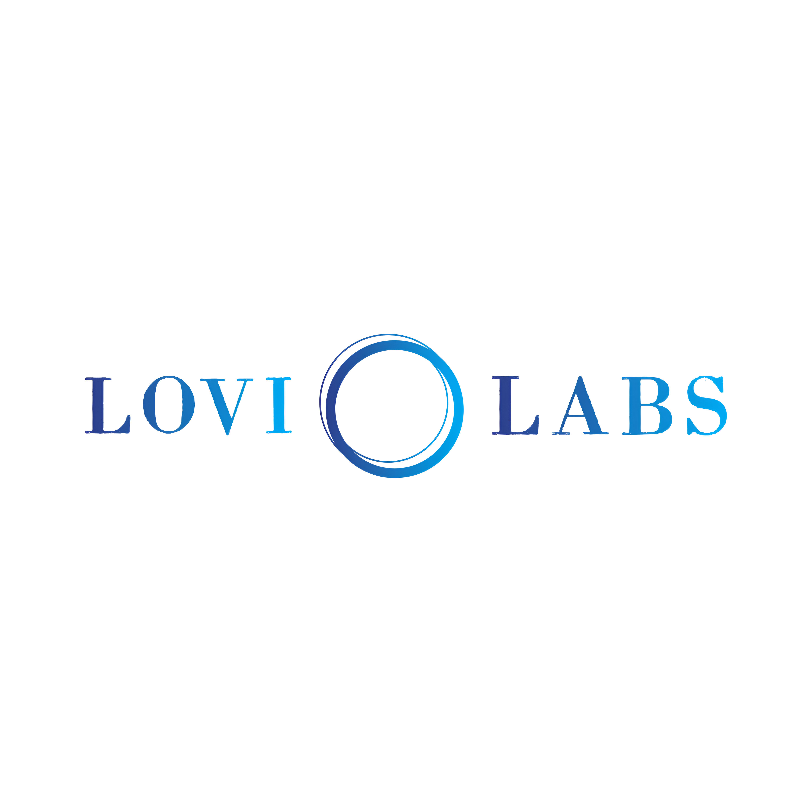

# Lovi Labs — Digital Solutions



**Building digital experiences through Web, Marketing, Design & AI**

Lovi Labs is a digital solutions company focused on transforming ideas into impactful digital experiences. We help businesses build and strengthen their digital presence through modern websites, web applications, UI/UX design, social media marketing, and AI-powered solutions.

## 🚀 Tech Stack

- **Framework**: Next.js 16 (App Router)
- **Styling**: Vanilla CSS with custom design system
- **Animations**: GSAP-inspired custom hooks + CSS transitions
- **Fonts**: Inter & Outfit (via next/font)
- **Deployment**: Vercel-ready

## 📦 Getting Started

```bash
# Install dependencies
npm install

# Run development server
npm run dev
```

Open [http://localhost:3000](http://localhost:3000) to view the site.

## 🗂 Project Structure

```
src/
├── app/            # Pages (Home, About, Services, Portfolio, Team, Contact)
├── components/     # Reusable UI components
└── hooks/          # Custom React hooks
```

## 📄 Pages

| Page | Route | Description |
|------|-------|-------------|
| Home | `/` | Hero, services preview, pillars, CTA |
| About | `/about` | Mission, values, philosophy |
| Services | `/services` | 7 service cards, process steps |
| Portfolio | `/portfolio` | Coming Soon |
| Team | `/team` | Team member cards |
| Contact | `/contact` | Contact form, WhatsApp, socials |

## 🎨 Brand Colors

| Color | Hex |
|-------|-----|
| White | `#FFFFFF` |
| Black | `#0A0A0A` |
| Navy | `#003087` |
| Cyan | `#00BFFF` |

## 🔗 Connect With Us

- [TikTok](https://www.tiktok.com/@lovi_labs)
- [Facebook](https://web.facebook.com/profile.php?id=61594162310188)
- [LinkedIn](https://www.linkedin.com/company/lovi-labs)
- [WhatsApp](https://wa.me/94717995000)
- Email: lovilabsco@gmail.com

## 📜 License

© 2026 Lovi Labs. All rights reserved.
