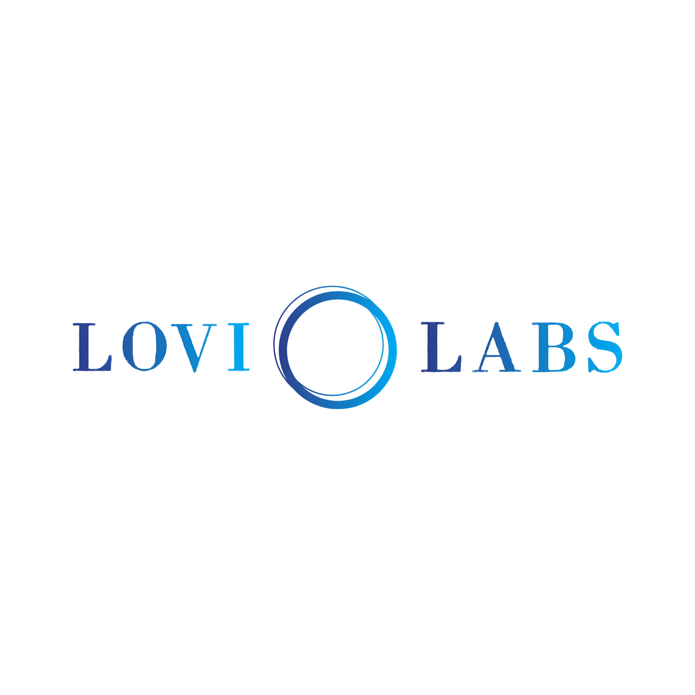

# Lovi Labs — Digital Solutions



**Building digital experiences through Web, Marketing, Design & AI**

Lovi Labs is a digital solutions company focused on transforming ideas into impactful digital experiences. We help businesses build and strengthen their digital presence through modern websites, web applications, UI/UX design, social media marketing, and AI-powered solutions.

## 🚀 Tech Stack

- **Framework**: Next.js 16 (App Router)
- **Styling**: Vanilla CSS with custom design system
- **Animations**: GSAP + CSS transitions
- **Fonts**: Inter & Outfit (via next/font)
- **Content**: Sanity CMS (`oyy58ymy`, `production` dataset)
- **Deployment**: Vercel with GitHub CI
- **Contact delivery**: Resend API

## 📦 Getting Started

```bash
# Install dependencies
npm install

# Run development server
npm run dev
```

Open [http://localhost:3000](http://localhost:3000) to view the site.

## ✏️ Content Management

The website uses Sanity for editable Team and Portfolio content. The frontend keeps its existing layout and styling, while published content is managed through the deployed Sanity Studio.

1. Open the [Lovi Labs Sanity Studio](https://lovilabs.sanity.studio).
2. Sign in with the Sanity account that has access to the project.
3. Manage **Team Member** and **Project** records.
4. Mark records as visible and click **Publish**.

For local work, copy `.env.example` to `.env.local`, then run `npm run studio` and `npm run dev`. Only records marked **Show on website** are displayed.

## 🚀 Deployment

Pushes to `main` deploy through Vercel. GitHub Actions also runs `npm ci` and `npm run build` on pushes and pull requests.

Configure these values in Vercel for Production and Preview deployments:

```env
NEXT_PUBLIC_SANITY_PROJECT_ID=oyy58ymy
NEXT_PUBLIC_SANITY_DATASET=production
RESEND_API_KEY=your_resend_api_key
CONTACT_TO_EMAIL=lovilabsco@gmail.com
CONTACT_FROM_EMAIL=Lovi Labs <your_verified_domain_email>
```

Never commit `.env.local` or API keys.

## 🗂 Project Structure

```
src/
├── app/            # Pages (Home, About, Services, Portfolio, Team, Contact)
├── components/     # Reusable UI components
└── hooks/          # Custom React hooks
```

## 📄 Pages

| Page | Route | Description |
|------|-------|-------------|
| Home | `/` | Hero, services preview, pillars, CTA |
| About | `/about` | Mission, values, philosophy |
| Services | `/services` | 7 service cards, process steps |
| Portfolio | `/portfolio` | CMS-managed project showcase, with Coming Soon fallback |
| Team | `/team` | CMS-managed team member cards |
| Contact | `/contact` | Contact form, WhatsApp, socials |

## 🎨 Brand Colors

| Color | Hex |
|-------|-----|
| White | `#FFFFFF` |
| Black | `#0A0A0A` |
| Navy | `#003087` |
| Cyan | `#00BFFF` |

## 🔗 Connect With Us

- [TikTok](https://www.tiktok.com/@lovi_labs)
- [Facebook](https://web.facebook.com/profile.php?id=61594162310188)
- [LinkedIn](https://www.linkedin.com/company/lovi-labs)
- [WhatsApp](https://wa.me/94717995000)
- Email: lovilabsco@gmail.com

## 📜 License

© 2026 Lovi Labs. All rights reserved.
